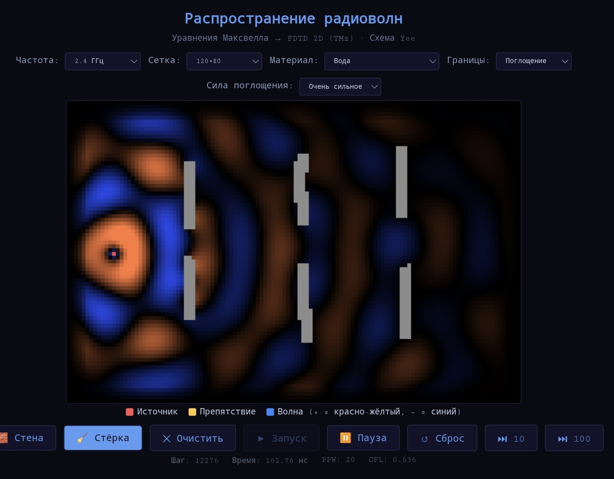

# FDTD 2D — Electromagnetic Wave Simulator

A real-time **2D FDTD (Finite-Difference Time-Domain) simulator** for electromagnetic wave propagation, built with pure JavaScript and HTML5 Canvas.

This project numerically solves **Maxwell's equations** using the **Yee grid scheme** for TMz polarization directly in the browser — no libraries, no WebGL, no backend.

---

## Features

- **Yee FDTD Scheme**: Staggered E and H field grids with correct finite-difference updates
- **Multiple Materials**: PEC, concrete, brick, glass, wood, water, ground with realistic $\varepsilon$ and $\sigma$
- **Interactive Drawing**: Paint obstacles directly on the canvas in real-time
- **Adjustable Parameters**: Frequency (10 MHz – 50 GHz), grid resolution, CFL timestep
- **Real-time Visualization**: Color-coded $E_z$ field — positive (red-yellow) and negative (blue)
- **Performance Optimized**: `Float32Array` buffers, offscreen canvas rendering, batched simulation steps

---

## Physical Model

The simulator solves the **TMz mode** of Maxwell's curl equations on a staggered Yee grid.

### Maxwell's Equations (TMz)

$$\frac{\partial E_z}{\partial t} = \frac{1}{\varepsilon}\left(\frac{\partial H_y}{\partial x} - \frac{\partial H_x}{\partial y} - \sigma E_z\right)$$

$$\frac{\partial H_x}{\partial t} = -\frac{1}{\mu_0}\frac{\partial E_z}{\partial y}$$

$$\frac{\partial H_y}{\partial t} = \frac{1}{\mu_0}\frac{\partial E_z}{\partial x}$$

### FDTD Update Equations (Discretized)

Using second-order central differences on the Yee grid:

$$H_x^{n+\frac{1}{2}} = H_x^{n-\frac{1}{2}} - \frac{\Delta t}{\mu_0 \Delta y}\left(E_z^n|_{j+1} - E_z^n|_{j}\right)$$

$$H_y^{n+\frac{1}{2}} = H_y^{n-\frac{1}{2}} + \frac{\Delta t}{\mu_0 \Delta x}\left(E_z^n|_{i+1} - E_z^n|_{i}\right)$$

$$E_z^{n+1} = C_a \cdot E_z^n + C_b \cdot \left(\frac{H_y^{n+\frac{1}{2}}|_i - H_y^{n+\frac{1}{2}}|_{i-1}}{\Delta x} - \frac{H_x^{n+\frac{1}{2}}|_j - H_x^{n+\frac{1}{2}}|_{j-1}}{\Delta y}\right)$$

Where material coefficients are:

$$C_a = \frac{1 - \frac{\sigma \Delta t}{2\varepsilon \varepsilon_0}}{1 + \frac{\sigma \Delta t}{2\varepsilon \varepsilon_0}}$$

$$C_b = \frac{\frac{\Delta t}{\varepsilon \varepsilon_0}}{1 + \frac{\sigma \Delta t}{2\varepsilon \varepsilon_0}}$$

### Stability Condition (CFL)

$$\Delta t \leq \frac{\Delta x}{c_0 \sqrt{2}}$$

where $c_0 = 299792458$ m/s is the speed of light in vacuum.

### Source Excitation

The simulator uses a hard source at position $(x_s, y_s)$:

$$E_z(x_s, y_s, t) = \sin(\omega t)$$

where $\omega = 2\pi f$ is the angular frequency.

---

## Simulation Parameters

| Parameter | Description |
|-----------|-------------|
| Frequency $f$ | 10 MHz – 50 GHz |
| Grid $N_x \times N_y$ | 80×53 to 320×213 |
| Wavelength $\lambda$ | $\lambda = c_0 / f$ |
| Points per wavelength | $\text{PPW} = \lambda / \Delta x \approx 20$ |
| CFL number | $c_0 \Delta t / \Delta x \approx 0.9$ |
| Materials | $\varepsilon$ from 1 to 81, $\sigma$ up to $10^{20}$ (PEC) |

---

## How to Run

1. Clone or download the repository
2. Open `index.html` in any modern browser
3. Click **▶ Запуск** to start the simulation
4. Use **🧱 Стена** to draw obstacles, **🧹 Стёрка** to remove them

No build step, no dependencies.

---

## Known Limitations

- **Absorbing boundary condition is simplified**: The current implementation uses exponential damping $E_z \leftarrow E_z \cdot d$ rather than a true PML (Perfectly Matched Layer). This causes artificial reflections from boundaries during long simulations.
- **2D only**: TMz mode assumes infinite extent in z-direction. Real antennas radiate in 3D.
- **Point source**: Single-cell hard source excitation, not a realistic antenna model with proper feed structure.
- **No dispersive materials**: $\varepsilon$ and $\sigma$ are frequency-independent. Real materials (water, ground) exhibit significant dispersion at RF frequencies.
- **PEC detection hack**: PEC is identified by `sigma > 1e6` rather than a dedicated material flag — this is a prototype shortcut that works but is not architecturally clean.

These limitations mean this simulator is an **educational tool** for visualizing wave propagation principles, not a precision engineering solver. For production-grade EM simulation, use tools like OpenEMS, MEEP, or CST.

---

## Technologies

Built with:

- HTML5
- JavaScript (vanilla, no frameworks)
- Canvas 2D API
- `Float32Array` for efficient memory usage

No external dependencies.

---

## License

MIT License — see [LICENSE](LICENSE) file for details.

---

## Author

Interactive physical wave simulators collection:
- **FDTD-Wave-Simulator** — this project (Maxwell's equations, Yee grid)
- **FourierPixelMatrix** — lensless Fourier holography simulator
- **Photon-Ray-Tracer** — ray tracing for radio wave propagation
