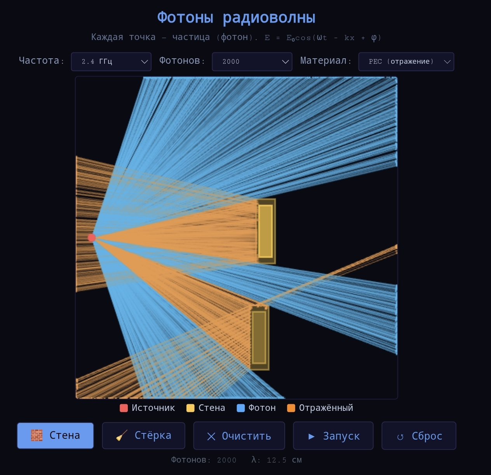

# Photon Ray Tracer — Radio Wave Propagation

An interactive **2D ray tracing simulator** for visualizing radio wave propagation, reflection, and transmission through obstacles. Built with pure JavaScript and HTML5 Canvas.

Despite the name "photons", this is a **classical geometric optics** simulator — not a quantum mechanical model. Each ray represents the path of electromagnetic energy from the source.

---

## Features

- **Multi-ray Source**: Configurable number of rays (100–2000) emitted in a fan pattern (±72°)
- **Interactive Obstacles**: Draw walls directly on the canvas in real-time
- **Material Types**:
  - **PEC (Perfect Electric Conductor)** — 100% reflection, zero transmission
  - **Concrete / Glass** — simplified partial transmission model
- **Ray History**: Each ray's complete trajectory is stored and visualized
- **Color Coding**: Direct rays (blue) vs reflected rays (orange)

---

## Physical Model

This simulator uses **geometric optics** (ray optics) approximation, valid when the wavelength $\lambda$ is much smaller than obstacle dimensions.

### Ray Propagation

Each ray is launched from the source at position $(x_s, y_s)$ with direction vector $\vec{v} = (\cos\theta, \sin\theta)$:

$$x(t) = x_s + v_x \cdot t$$

$$y(t) = y_s + v_y \cdot t$$

### Reflection (Simplified)

For PEC walls, the ray reflects with angle of incidence equal to angle of reflection:

$$v_x' = -v_x \quad \text{or} \quad v_y' = -v_y$$

depending on which wall face is hit.

This is a **simplified model**. In reality, reflection coefficients depend on:
- Incident angle (Fresnel equations)
- Wave polarization (TE/TM)
- Material properties ($\varepsilon$, $\sigma$)

$$R_{TE} = \frac{\cos\theta_i - \sqrt{\varepsilon - \sin^2\theta_i}}{\cos\theta_i + \sqrt{\varepsilon - \sin^2\theta_i}}$$

$$R_{TM} = \frac{\varepsilon\cos\theta_i - \sqrt{\varepsilon - \sin^2\theta_i}}{\varepsilon\cos\theta_i + \sqrt{\varepsilon - \sin^2\theta_i}}$$

### Transmission (Simplified)

For dielectric materials (concrete, glass), the current model uses a **stochastic approach**:

- 30% chance of reflection
- 70% chance of transmission (ray passes through unchanged)

A physically correct model would calculate the transmission coefficient:

$$T = 1 - |R|^2$$

and attenuate the ray's energy accordingly.

### What's NOT Simulated

| Missing Physics | Why It Matters |
|-----------------|----------------|
| $1/r^2$ path loss | Real signals decay with distance |
| Material absorption | Concrete blocks WiFi, doesn't just reflect |
| Phase & interference | No constructive/destructive interference patterns |
| Diffraction | Rays don't bend around obstacle edges |
| Fresnel zones | No elliptical clearance zones around rays |
| Polarization | All rays treated identically |

---

## Comparison with Other Simulators in This Collection

| Simulator | Method | Physics Fidelity |
|-----------|--------|------------------|
| **FDTD-Wave-Simulator** | Yee grid, Maxwell's equations | High — full wave physics |
| **FourierPixelMatrix** | Superposition, Fourier optics | Medium — wave interference |
| **Photon-Ray-Tracer** (this) | Geometric ray tracing | Low — ray approximation only |

Ray tracing is the **fastest** method but the **least physically accurate** for wave phenomena like interference and diffraction.

---

## When to Use This Simulator

- ✅ Visualizing ray paths and reflection patterns
- ✅ Understanding multi-path propagation conceptually
- ✅ Quick "what-if" scenarios for obstacle placement
- ❌ Calculating actual signal strength (no path loss model)
- ❌ Predicting interference patterns (no wave physics)
- ❌ Modeling diffraction around corners (rays only go straight)

---

## How to Run

1. Clone or download the repository
2. Open `index.html` in any modern browser
3. Click **▶ Запуск** to trace rays
4. Draw walls with **🧱 Стена**, remove with **🧹 Стёрка**

No build step, no dependencies.

---

## Known Limitations

- **No wave effects**: Interference, diffraction, and standing waves are completely absent
- **Simplified reflection**: No Fresnel equations, no angle-dependent reflectivity
- **No path loss**: Rays don't attenuate with distance or through materials
- **Stochastic transmission**: The 30/70 split is arbitrary, not based on material properties
- **Basic collision detection**: Uses simple bounding box checks, not precise ray-segment intersection
- **Misleading name**: "Photons" is used loosely — this is classical ray optics, not quantum electrodynamics

---

## Technologies

Built with:

- HTML5
- JavaScript (vanilla, no frameworks)
- Canvas 2D API

No external dependencies.

---

## License

MIT License — see [LICENSE](LICENSE) file for details.

---

## Author

Interactive physical wave simulators collection:
- **FDTD-Wave-Simulator** — Maxwell's equations, Yee grid (high fidelity)
- **FourierPixelMatrix** — Lensless Fourier holography (medium fidelity)
- **Photon-Ray-Tracer** — Geometric ray tracing (low fidelity, this project)
