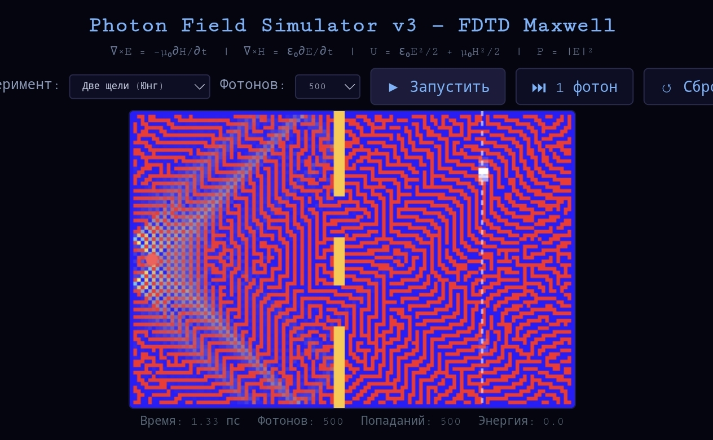

# Young's Experiment — FDTD Maxwell Solver

The famous **Young's double-slit experiment** simulated by numerically solving Maxwell's equations using the FDTD method, with photon-by-photon detection.

---

## What It Does

1. **Phase 1 — Wave Propagation**: An electromagnetic pulse propagates through the scene, interacts with obstacles (wall, double slit, half-plane), and forms an interference pattern on the detector screen.

2. **Phase 2 — Photon Detection**: Individual "photons" are sampled on the screen. The probability of a photon hitting position $y$ is proportional to the field intensity $|E_z(y)|^2$. With enough photons, the interference pattern emerges — exactly as in the real experiment.

---

## Physical Model

### Maxwell's Equations (TMz mode, Yee grid)

$$\frac{\partial E_z}{\partial t} = \frac{1}{\varepsilon_0}\left(\frac{\partial H_y}{\partial x} - \frac{\partial H_x}{\partial y}\right)$$

$$\frac{\partial H_x}{\partial t} = -\frac{1}{\mu_0}\frac{\partial E_z}{\partial y}$$

$$\frac{\partial H_y}{\partial t} = \frac{1}{\mu_0}\frac{\partial E_z}{\partial x}$$

### Source

Gaussian pulse with carrier frequency (500 THz — green light):

$$E_z(x_s, y_s, t) = \exp\left(-\frac{(t - t_0)^2}{2\tau^2}\right) \cdot \sin(2\pi f t)$$

### Detection

Photon hit probability at screen position $y$:

$$P(y) = \frac{|E_z(y)|^2}{\sum_y |E_z(y)|^2}$$

### Field Energy

Total electromagnetic energy in the simulation domain:

$$U = \int \left(\frac{\varepsilon_0}{2}|E|^2 + \frac{\mu_0}{2}|H|^2\right) dV$$

---

## Experiments

| Scene | Description |
|-------|-------------|
| **Two Slits (Young)** | Classic interference — photons form bright and dark fringes |
| **Free Space** | Wave propagates without obstacles |
| **Wall Reflection** | Wave reflects from a single PEC wall |
| **Edge Diffraction** | Half-plane knife-edge diffraction |

---

## How It Differs from Other Simulators

| Simulator | Method | Detection |
|-----------|--------|-----------|
| **FDTD-Wave-Simulator** | Maxwell grid solver | Continuous field visualization |
| **Photon-Ray-Tracer** | Geometric rays | Ray trajectories |
| **Young-Experiment-FDTD** (this) | Maxwell grid solver | Photon-by-photon accumulation |

This is the only simulator in the collection that shows the **particle-like detection** of a classical wave — the essence of wave-particle duality in quantum mechanics.

---

## Known Limitations

- **Detection is classical, not quantum**: Photon sampling uses $|E|^2$ probability distribution — this is semiclassical detection theory, not full quantum electrodynamics. True single-photon states would require quantizing the electromagnetic field.

- **Simplified absorbing boundaries**: Uses exponential damping rather than PML. Some artificial reflections from domain edges may occur.

- **Fixed detector position**: The detector screen is fixed at $x = 95$, cannot be moved interactively.

- **Fixed source frequency**: 500 THz (green light) is hardcoded. Changing this requires modifying the source function.

- **No dispersive materials**: All obstacles are perfect electric conductors (PEC). Dielectric walls with $\varepsilon > 1$ are not implemented.

---

## How to Run

1. Open `index.html` in a browser
2. Select an experiment from the dropdown
3. Click **▶ Запустить** to propagate the wave and start detection
4. Use **⏭ 1 фотон** to send individual photons one by one
5. Watch the interference pattern emerge on the detector screen

---

## Why This Matters

This simulation demonstrates the **wave-particle duality** that lies at the heart of quantum mechanics:

- The electromagnetic field propagates as a **wave** (Maxwell's equations)
- The detector registers individual **particles** (localized hits)
- The accumulation of many hits reveals the wave's **interference pattern**

This is exactly what one observes in a real laboratory Young's experiment with attenuated light.
